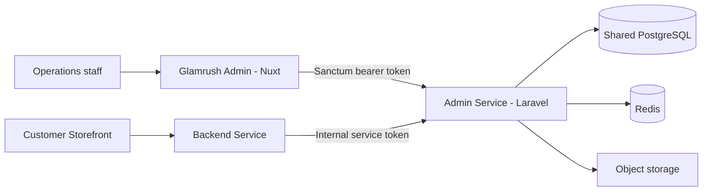

# Admin Service architecture

## Purpose

The Admin Service is Glamrush's operational control plane. It owns catalog authoring and exposes authenticated APIs to the Admin frontend. It also publishes a small protected internal API used by the customer-facing Backend Service.



## Code organization

The application is organized by business capability under `app/Domain`, with HTTP delivery under `app/Http`, persistence and other technical concerns under `app/Infrastructure`, and Eloquent records under `app/Models`.

Typical request flow:

```text
Route -> authentication/permission middleware -> controller -> use case/domain service
      -> repository or Eloquent model -> resource/response
```

Major domain modules include Access Control, Auth, Catalog modules, Content, Dashboard, Discount, Newsletter, Order, Payment Method, Shipping, Storefront, and Vendor.

## Data ownership

The Admin Service is the migration owner for:

- Products, variants, categories, `category_product`, brands, vendors, and collections
- Media metadata and SKU/attribute configuration
- Storefront campaigns and homepage merchandising
- Content pages and FAQs
- Shipping and payment-method configuration
- Discount definitions and targets
- Admin users, roles, and permissions

The Backend Service owns customer carts, customer addresses, checkout execution, orders, payment attempts, redemptions, contact submissions, and storefront newsletter subscription writes. Because both APIs currently share one database, avoid creating duplicate migrations or cross-repository schema changes without confirming ownership.

## Authentication and authorization

- Staff authentication uses Sanctum bearer tokens.
- Route-level permissions are enforced through Spatie Laravel Permission.
- The Admin frontend hydrates the current user through the authenticated identity endpoint.
- The internal storefront endpoint uses `STOREFRONT_INTERNAL_API_TOKEN`, independently of staff sessions.
- Password-reset codes are persisted and time-limited.

Production deployments must use TLS, strong rotated tokens, restrictive CORS, secure logs, and least-privilege database/storage credentials.

## Catalog and merchandising

Products can belong to multiple categories through `category_product`; one relation may be marked primary for backward-compatible presentation. Storefront roots scope the catalog exposed by the customer Backend Service. Campaign and homepage-section records determine the published customer homepage.

Catalog mutations participate in shared cache-version invalidation so the Backend Service does not continue serving stale product or merchandising responses.

## Caching and background work

The service supports Laravel cache stores and records cache metrics in Redis when enabled. Scheduled commands aggregate dashboard and cache metrics. Queue workers process asynchronous work such as email and operational jobs.

Production process model:

- One or more HTTP instances
- One or more queue workers, or Horizon if introduced and configured
- Exactly one logical scheduler invocation per minute
- PostgreSQL and Redis as managed dependencies

## Integration boundaries

| Integration | Direction | Contract |
| --- | --- | --- |
| Admin frontend | Inbound | `/api/v1`, Sanctum bearer token |
| Backend Service | Inbound | `/api/internal/v1/storefronts/{storefront}/homepage`, internal token |
| PostgreSQL | Outbound | Eloquent and migrations |
| Redis | Outbound | Cache, queues, and cache metrics |
| Object storage | Outbound | Product and merchandising media |
| Mail provider | Outbound | Staff and operational email |

New internal service endpoints should be versioned, use a service credential rather than a staff token, return stable resource contracts, and include explicit timeout/cache expectations.

## Testing strategy

- Unit tests cover isolated actions and authentication rules.
- Integration tests cover use cases and persistence behavior.
- Feature tests cover HTTP authorization, catalog management, merchandising, content, discounts, newsletters, dashboard/cache endpoints, and manual orders.

Run the suite with `composer test` and keep database-dependent behavior isolated through Laravel's testing facilities.
